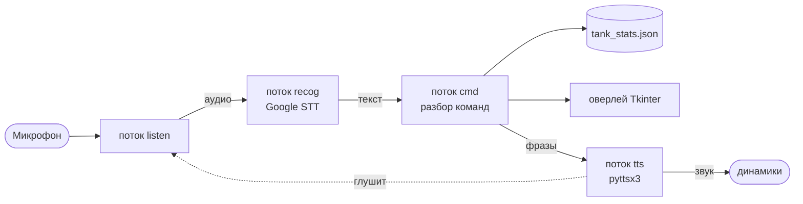

# 🎙️ Tank Stats Voice Tracker

**Голосовой трекер статистики боёв для World of Tanks Blitz.**
Полупрозрачный оверлей поверх игры показывает статистику текущей сессии, а вы управляете им голосом — не отрываясь от боя. После каждого выстрела называете урон, в конце боя исход, программа сама считает винрейт, средний и лучший урон, ведёт историю по сессиям и танкам.


<!-- Добавьте сюда скриншот оверлея:  -->

---

## Содержание

- [Возможности](#возможности)
- [Как это работает](#как-это-работает)
- [Требования](#требования)
- [Установка](#установка)
- [Русский голос для озвучки](#русский-голос-для-озвучки)
- [Использование](#использование)
- [Голосовые команды](#голосовые-команды)
- [Настройка](#настройка-configjson)
- [Файлы данных](#файлы-данных)
- [Решение проблем](#решение-проблем)
- [Лицензия](#лицензия)

---

## Возможности

- **Оверлей поверх игры** — полупрозрачное окно always-on-top, перетаскивается мышью, запоминает позицию.
- **Голосовое управление на русском** — новая сессия, урон, победа/поражение, отмена, статус и т.д.
- **Числа цифрами и словами** — понимает и `250`, и «двести пятьдесят».
- **Офлайн-озвучка** подтверждений через `pyttsx3` — без задержек и без интернета.
- **Учёт по сессиям** — количество боёв, процент побед, средний и лучший урон.
- **Статистика по танку за всё время** — агрегат по всем сессиям выбранного танка.
- **Экспорт в CSV** — все бои выгружаются в Excel-совместимый файл.
- **Надёжное хранение** — атомарная запись, бэкап при повреждении файла, восстановление незавершённой сессии после перезапуска.
- **Гибкая настройка** — цвета, размер, прозрачность, пороги микрофона и язык вынесены в `config.json`.

## Как это работает

Программа работает в нескольких потоках, чтобы распознавание, озвучка и интерфейс не блокировали друг друга:



Озвучка ставится в очередь и проигрывается по одной фразе; пока программа говорит, микрофон временно отключается — поэтому она не распознаёт собственный голос. Распознавание (Google STT) требует интернета, озвучка (`pyttsx3`/SAPI5) работает офлайн.

## Требования

- **Windows 10 / 11**
- **Python 3.12 или 3.13** (64-bit) — не 3.14 (для PyAudio под него пока нет готовых сборок)
- Микрофон
- Интернет — нужен для распознавания речи; озвучка и оверлей работают и без него
- Для русского голоса озвучки — установленный SAPI5-голос (см. [раздел ниже](#русский-голос-для-озвучки))

Зависимости (`requirements.txt`): `SpeechRecognition`, `PyAudio`, `pyttsx3`, `setuptools`.

## Установка

### 1. Установите Python

Скачайте Python 3.12 или 3.13 (64-bit) с [python.org](https://www.python.org/downloads/). При установке:

- отметьте **«Add python.exe to PATH»**;
- оставьте включённым компонент **«tcl/tk and IDLE»** (это `tkinter`, без него не запустится оверлей — по умолчанию галка стоит).

Проверьте установку:

```bash
python --version
```

### 2. Получите файлы

```bash
git clone <адрес-вашего-репозитория>
cd <папка-репозитория>
```

Либо скачайте `speech_ts.py` и `requirements.txt` в одну папку.

### 3. Создайте виртуальное окружение (рекомендуется)

```bash
py -3.12 -m venv .venv
.venv\Scripts\activate
```

После активации в начале строки появится `(.venv)`.

### 4. Установите зависимости

```bash
python -m pip install --upgrade pip
python -m pip install -r requirements.txt
```

> **Важно про Python 3.12+:** в нём из стандартной библиотеки удалён `distutils`, который нужен `SpeechRecognition`. Поэтому в зависимости включён `setuptools` (он содержит замену `distutils`). В свежем `venv` его нет по умолчанию — без него будет ошибка `ModuleNotFoundError: No module named 'distutils'`.

### 5. Запустите

```bash
python speech_ts.py
```

Для запуска двойным кликом создайте рядом `run.bat`:

```bat
@echo off
cd /d %~dp0
call .venv\Scripts\activate
python speech_ts.py
```

## Русский голос для озвучки

`pyttsx3` на Windows берёт голоса через **SAPI5**, а SAPI5 видит только голоса из ветки реестра `HKLM\SOFTWARE\Microsoft\Speech\Voices`. Русские голоса, добавленные через **Параметры Windows**, попадают в `...\Speech_OneCore\Voices` и SAPI5-приложениям недоступны — поэтому просто «добавить русский язык» обычно не помогает.

Сначала посмотрите, какие голоса реально доступны:

```python
import pyttsx3
for v in pyttsx3.init().getProperty("voices"):
    print(v.name, "|", v.id)
```

Если русского в списке нет:

- **Проще всего — [RHVoice](https://rhvoice.org/):** бесплатный open-source синтезатор, который регистрируется именно как SAPI5 и ставит русские голоса. `pyttsx3` подхватит их сразу, без правки реестра. После установки перезапустите программу.
- **Без сторонних программ:** скопируйте ключ нужного голоса из `...\Speech_OneCore\Voices\Tokens\<голос>` в `...\Speech\Voices\Tokens\` через `regedit` (от администратора).
- **Ничего не делать:** озвучка пойдёт английским голосом. Русский текст он прочитает с акцентом, но на сам учёт это не влияет — данные не теряются.

Голос подбирается автоматически по подстроке `ru`/`russ`; сузить выбор можно полем `tts_voice_hint` в `config.json`.

## Использование

После запуска в консоли появится `Калибровка микрофона…` — **3 секунды помолчите**, идёт замер фонового шума. Затем прозвучит «Программа учёта статистики запущена», и в правом нижнем углу экрана появится оверлей.

Типичный цикл:

1. Скажите **«новая сессия ИС-7»** — начнётся сессия для этого танка.
2. По ходу боя называйте урон: **«двести пятьдесят»**, **«триста»** — он суммируется.
3. Ошиблись — **«минус сто»** или **«сброс»**.
4. В конце боя — **«победа»** или **«поражение»**. Программа озвучит обновлённую статистику.
5. В любой момент — **«статус»** (текущая сессия) или **«итоги»** (танк за всё время).
6. **«конец»** — завершить сессию, **«экспорт»** — выгрузить всё в CSV.

**Управление окном:** перетаскивание — левая кнопка мыши; закрыть — `Esc`, `Ctrl+Q` или голосом «выход».

### Голосовые команды

| Команда | Действие |
|---|---|
| `новая сессия <танк>` | Начать новую сессию для указанного танка |
| `<число>` | Добавить урон к текущему бою (цифрами или словами) |
| `минус <число>` | Вычесть урон из текущего боя |
| `сброс` | Обнулить урон текущего боя |
| `победа` | Завершить бой как победу |
| `поражение` | Завершить бой как поражение |
| `отмена` | Удалить последний записанный бой |
| `статус` | Озвучить статистику текущей сессии |
| `итоги` | Статистика по текущему танку за всё время |
| `экспорт` | Выгрузить все бои в CSV |
| `конец` | Завершить текущую сессию |
| `выход` | Сохранить данные и закрыть программу |
| `помощь` | Вывести список команд в консоль |

## Настройка (config.json)

Файл `config.json` создаётся при первом запуске со значениями по умолчанию. Закройте программу, отредактируйте нужные поля и запустите снова.

| Параметр | По умолчанию | Описание |
|---|---|---|
| `data_file` | `tank_stats.json` | Файл с данными статистики |
| `export_file` | `tank_battles.csv` | Файл выгрузки CSV |
| `width` / `height` | `350` / `100` | Размер окна оверлея, px |
| `alpha` | `0.85` | Прозрачность окна, 0–1 |
| `bg` | `#1a1a1a` | Цвет фона |
| `font` / `font_size` | `Segoe UI` / `14` | Шрифт и размер |
| `color_tank` | `#ffffff` | Цвет названия танка |
| `color_time` | `#ffff00` | Цвет таймера сессии |
| `color_stat` | `#00ff00` | Цвет строк статистики |
| `color_current` | `#ff9900` | Цвет урона текущего боя |
| `language` | `ru-RU` | Язык распознавания |
| `energy_threshold` | `4000` | Порог чувствительности микрофона |
| `dynamic_energy` | `true` | Автоподстройка порога под шум |
| `pause_threshold` | `0.8` | Длина паузы, считающейся концом фразы, сек |
| `ambient_duration` | `3.0` | Длительность калибровки шума при старте, сек |
| `phrase_time_limit` | `3.0` | Максимальная длина одной фразы, сек |
| `listen_timeout` | `0.3` | Таймаут ожидания начала речи, сек |
| `tts_rate` | `null` | Скорость речи (`null` — по умолчанию) |
| `tts_voice_hint` | `ru` | Подстрока для выбора голоса озвучки |

## Файлы данных

Все файлы создаются рядом с `speech_ts.py`:

- **`tank_stats.json`** — основная база. Структура:

  ```json
  {
    "sessions": [
      {
        "tank_name": "ИС-7",
        "start_time": "2025-01-01T12:00:00",
        "end_time": null,
        "battles": [
          { "damage": 2500, "result": "victory", "timestamp": "2025-01-01T12:05:00" }
        ],
        "total_damage": 2500,
        "battles_count": 1,
        "victories_count": 1
      }
    ]
  }
  ```

- **`config.json`** — настройки (см. выше).
- **`window_pos.json`** — сохранённая позиция окна.
- **`tank_battles.csv`** — выгрузка по команде «экспорт» (разделитель `;`, кодировка UTF-8 с BOM — открывается в Excel без танцев с кодировками).
- **`tank_stats.json.corrupt-<дата>`** — если основной файл оказался повреждён, он сохраняется под таким именем, а работа продолжается с чистой базы.

Запись в `tank_stats.json` атомарная (через временный файл), поэтому аварийное завершение во время сохранения не повредит данные.

## Решение проблем

| Симптом | Причина и решение |
|---|---|
| `ModuleNotFoundError: No module named 'distutils'` | Python 3.12+ без `setuptools`. Выполните `pip install setuptools` (или переустановите по обновлённому `requirements.txt`). |
| Ошибка сборки PyAudio / `Microsoft Visual C++ 14.0 required` | Python 3.14 или 32-битный без готового колеса. Возьмите Python 3.12/3.13 64-bit либо установите «Microsoft C++ Build Tools». |
| `No module named 'tkinter'` / `_tkinter` | При установке Python не был отмечен «tcl/tk and IDLE». Переустановите Python с этой галкой. |
| `pyttsx3` падает с `KeyError: None` или `cannot import name 'SpeechLib'` | Битый кэш `comtypes`. Удалите папку `...\site-packages\comtypes\gen` (пересоздастся) или `pip install --force-reinstall comtypes`. |
| В логах `Синтез речи недоступен` | Нет рабочего устройства вывода или SAPI. Проверьте динамики/наушники. |
| В логах `Микрофон недоступен` | Нет устройства ввода или доступа к микрофону. Параметры → Конфиденциальность → Микрофон → разрешить классическим приложениям. |
| `Сервис распознавания недоступен` | Нет интернета или превышен лимит бесплатного Google STT. Проверьте сеть/прокси. |
| Озвучка по-английски | Не установлен русский SAPI5-голос. См. [Русский голос](#русский-голос-для-озвучки). |
| Оверлей не виден поверх игры | В эксклюзивном полноэкранном режиме окна `topmost` перекрываются. Переведите игру в режим «оконный без рамки» (borderless windowed). |

## Лицензия

GPL 3.0 — см. файл [LICENSE](LICENSE). 

---

> ⚠️ Программа создавалась как личный инструмент и не связана с Wargaming. Распознавание речи использует бесплатный Google Web Speech API (есть лимиты и зависимость от интернета).
